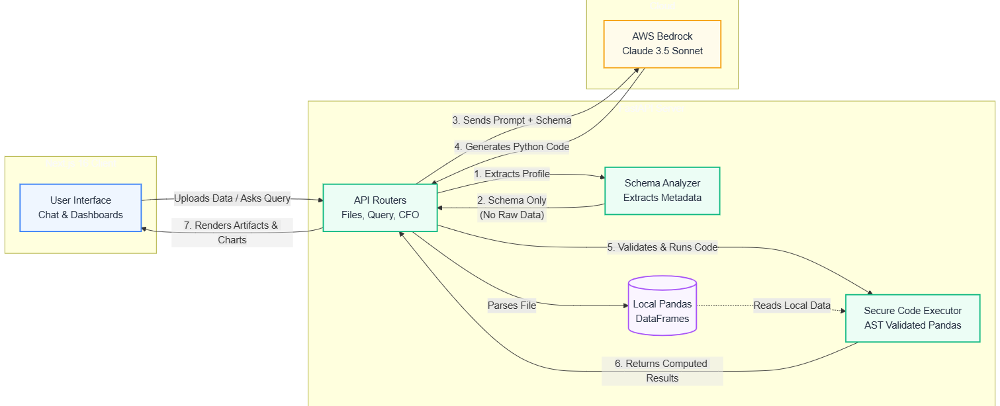

<div align="center">

# AEGIS

### Your Privacy-First AI CFO


</div>

---

## Overview

**Aegis** is a privacy-first AI CFO that lets you upload financial CSVs and Excel files, ask questions through voice or text, run what-if scenarios, and receive dynamic charts and executive briefings — all without your raw data ever leaving your machine. The backend is powered by **FastAPI** and **Pandas**, the frontend by **Next.js 16** and **React 19**, and the AI layer by **Claude on AWS Bedrock**. Only data schemas (column names, types, and aggregate statistics) are sent to the LLM; all generated Pandas code executes locally in an AST-validated sandbox.

---

## Features

- **100% Privacy / Schema-Only Profiling** — Raw rows never reach the LLM. Only column names, data types, and summary statistics are sent to Claude.
- **Voice Q&A** — Ask financial questions by voice using the Web Speech API; responses are read back via Edge TTS.
- **Multi-File Upload** — Upload and analyze multiple CSV/XLSX files simultaneously with automatic financial column detection.
- **Auto-Generated Charts** — AI selects the optimal chart type (bar, line, pie) and renders interactive Recharts visualizations.
- **Executive Briefing** — One-click time-aware briefing with key metrics, risks, and actionable recommendations.
- **Financial Health Score** — A 0-100 composite score grading data completeness, consistency, anomaly levels, and coverage.
- **Automated Audit** — Detects duplicate transactions, statistical outliers (IQR method), missing values, and date inconsistencies.
- **What-If Scenario Engine** — Describe a hypothetical change in plain English; Aegis computes baseline vs. projected metrics side-by-side.
- **Smart Suggestions** — Context-aware follow-up questions and scenario ideas generated after each query.
- **Dark Mode UI** — A cyber-themed interface with a lime-on-dark color palette, fully toggleable.

---

## Architecture



---

## Request Lifecycles

### 1. Upload Flow

```
User drops CSV/XLSX
       |
       v
  FileProcessor.parse()          ->  pd.read_csv / pd.read_excel
       |
       v
  SchemaAnalyzer.extract()       ->  Column names, dtypes, nulls,
       |                             unique counts, first 3 samples,
       |                             min/max/mean (numeric only)
       v
  Auditor.run_audit()            ->  Duplicates, outliers (IQR),
       |                             missing values, future dates
       v
  BriefingGenerator.generate()   ->  Schema sent to Claude ->
       |                             executive greeting + key metrics
       v
  HealthScore.calculate()        ->  Composite 0-100 score:
       |                             completeness (30%), consistency (25%),
       |                             anomaly level (30%), coverage (15%)
       v
  Response returned              ->  File ID, schema, audit report,
                                     briefing, health grade
```

### 2. Query / What-If Flow

```
User types question or describes scenario
       |
       v
  BedrockClient.generate()       ->  System prompt + schema + question
       |                             sent to Claude (NO raw data)
       v
  Claude returns JSON            ->  {
       |                                output_type, render_mode,
       |                                aggregation_code,
       |                                chat_message, artifact, insight
       |                              }
       v
  SecureCodeExecutor.execute()   ->  1. Strip imports
       |                             2. AST whitelist validation
       |                             3. Dangerous-op blacklist check
       |                             4. Execute in restricted globals
       |                             (real DataFrame, pd, np, datetime)
       v
  Placeholder injection          ->  RESULT_VALUE / RESULT_DATA tokens
       |                             replaced with actual computed values
       v
  Frontend rendering             ->  Chat bubble, Recharts visualization,
                                     or full artifact HTML panel
```

---

## Data Handling & Safety

### Schema-Only Profiling

The core privacy guarantee: **raw data rows never leave your machine**. When Aegis communicates with Claude on AWS Bedrock, it sends only a structural profile of each uploaded file:

| Sent to Claude | **NOT** Sent to Claude |
|---|---|
| Column names | Individual row values |
| Data types (int64, object, ...) | Full CSV contents |
| Non-null / unique counts | Personally identifiable information |
| Min / max / mean (numeric) | Raw financial transactions |
| First 3 unique sample values | Complete dataset |

### AST-Validated Sandbox

All LLM-generated Pandas code is executed locally through a multi-layer security pipeline:

1. **Import Stripping** — Every `import` and `from ... import` statement is removed before execution.
2. **AST Whitelist** — The code is parsed into an Abstract Syntax Tree. Only explicitly allowed node types pass (assignments, loops, comparisons, calls, comprehensions). Function definitions, class definitions, decorators, and `try/except` blocks are rejected.
3. **Dangerous Operation Blacklist** — Calls to `open`, `eval`, `exec`, `compile`, `__import__`, `system`, `popen`, `subprocess`, `os`, `sys`, `shutil`, `socket`, and file I/O functions are blocked.
4. **Restricted `__builtins__`** — The execution environment exposes only safe built-in functions (`len`, `str`, `int`, `float`, `round`, `abs`, `range`, `sorted`, etc.). Access to the full `__builtins__` dict is removed.
5. **Pre-Loaded Globals Only** — The sandbox provides `pd` (pandas), `np` (numpy), `datetime`, `timedelta`, and the user's DataFrame(s). No other modules are accessible.
6. **Server-Side Artifact Injection** — Chart HTML and artifact content are assembled on the backend and injected into responses; the frontend renders them in isolated containers.

---

## Limits & Defaults

| Parameter | Default | Notes |
|---|---|---|
| **Max file size** | 50 MB | Configurable via `MAX_UPLOAD_SIZE_MB` |
| **Allowed extensions** | `.csv`, `.xlsx`, `.xls` | Configurable via `ALLOWED_EXTENSIONS` |
| **LLM max tokens** | 4,096 | Per request to Claude |
| **LLM temperature** | 0.0 (queries) / 0.7 (suggestions) | Deterministic for analysis, creative for ideas |
| **Dashboard charts** | Exactly 2 | Plus 4-6 KPI cards per generation |
| **Chart item limit** | Top 10 | Pie/bar charts capped at 10 categories |
| **Session storage** | In-memory | Files stored on disk in `uploads/`; metadata in memory |
| **CORS origins** | `http://localhost:3000` | Configurable via `CORS_ORIGINS` |
| **Multi-file support** | Unlimited | Each file registered as a named DataFrame |
| **TTS engine** | Edge TTS | Free, no API key required |
| **Health score weights** | 30 / 25 / 30 / 15 | Completeness, Consistency, Anomalies, Coverage |

---

## Getting Started

### Prerequisites

- **Python 3.11+** with `pip`
- **Node.js 20+** with `npm`
- **AWS Account** with Bedrock access enabled for Claude models

### 1. Clone the Repository

```bash
git clone https://github.com/your-username/aegis.git
cd aegis
```

### 2. Backend Setup

```bash
cd backend

# Create and activate virtual environment
python -m venv venv
source venv/bin/activate        # Linux / macOS
venv\Scripts\activate           # Windows

# Install dependencies
pip install -r requirements.txt

# Configure environment
cp .env.example .env
# Edit .env with your AWS credentials (see Configuration section below)

# Start the server
uvicorn main:app --host 0.0.0.0 --port 8000 --reload
```

The API will be available at **http://localhost:8000** with interactive docs at `/docs`.

### 3. Frontend Setup

```bash
cd frontend

# Install dependencies
npm install

# Configure environment
cp .env.local.example .env.local
# Edit .env.local if your backend runs on a different host/port

# Start the dev server
npm run dev
```

The app will be available at **http://localhost:3000**.

### 4. Required Environment Variables

**Backend** (`backend/.env`):

```env
# AWS Credentials (required)
AWS_ACCESS_KEY_ID=your_access_key
AWS_SECRET_ACCESS_KEY=your_secret_key
AWS_SESSION_TOKEN=                            # Optional, for temporary credentials
AWS_REGION=us-east-1

# Model
BEDROCK_MODEL_ID=us.anthropic.claude-sonnet-4-5-20250929-v1:0

# Server
PORT=8000
HOST=0.0.0.0
DEBUG=True
CORS_ORIGINS=http://localhost:3000

# Uploads
MAX_UPLOAD_SIZE_MB=50
ALLOWED_EXTENSIONS=csv,xlsx,xls

# Security
SECRET_KEY=change_this_in_production_to_a_secure_random_string
```

**Frontend** (`frontend/.env.local`):

```env
NEXT_PUBLIC_API_URL=http://localhost:8000
NEXT_PUBLIC_ENABLE_VOICE=true
NEXT_PUBLIC_ENABLE_CHARTS=true
```

---

## Project Structure

```
aegis/
|
+-- backend/
|   +-- main.py                          # FastAPI app entry point, CORS, router mounts
|   +-- requirements.txt                 # Python dependencies
|   +-- .env.example                     # Environment variable template
|   +-- app/
|       +-- routers/
|       |   +-- files.py                 # Upload, list, delete, audit endpoints
|       |   +-- query.py                 # NL query -> Pandas code -> execute pipeline
|       |   +-- cfo.py                   # Dashboard, briefing, health, scenarios, suggestions
|       |   +-- tts.py                   # Text-to-speech via Edge TTS
|       |   +-- health.py               # Liveness + AWS connectivity checks
|       +-- services/
|       |   +-- bedrock_client.py        # AWS Bedrock / Claude API integration
|       |   +-- code_executor.py         # AST-validated sandboxed Pandas execution
|       |   +-- schema_analyzer.py       # Privacy-first schema extraction (no raw data)
|       |   +-- file_processor.py        # CSV/Excel parsing + financial column detection
|       |   +-- auditor.py              # Duplicate, outlier, missing data, date checks
|       |   +-- briefing_generator.py    # Executive briefing generation
|       |   +-- health_score.py          # Composite 0-100 financial health scoring
|       |   +-- tts_service.py           # Edge TTS wrapper
|       +-- models/
|       |   +-- schemas.py               # Pydantic request/response models
|       +-- utils/
|           +-- validators.py            # Input validation helpers
|
+-- frontend/
|   +-- package.json                     # Dependencies (Next.js 16, React 19, Recharts)
|   +-- next.config.ts                   # Next.js configuration
|   +-- .env.local.example               # Frontend env template
|   +-- app/
|       +-- layout.tsx                   # Root layout with theme + voice providers
|       +-- page.tsx                     # Landing page / upload gate
|       +-- globals.css                  # Tailwind CSS + global styles
|       +-- dashboard/
|       |   +-- page.tsx                 # Main financial dashboard
|       +-- components/
|       |   +-- ChatInterface.tsx        # Chat message display + input
|       |   +-- EnhancedChat.tsx         # Extended chat with suggestions + scenarios
|       |   +-- FileUploader.tsx         # Drag-and-drop file upload
|       |   +-- VoiceCommandBar.tsx      # Speech recognition input bar
|       |   +-- ExecutiveDashboard.tsx   # KPI cards + chart grid
|       |   +-- ConsolidatedDashboard.tsx  # Unified multi-panel dashboard
|       |   +-- BriefingPanel.tsx        # Executive briefing display
|       |   +-- AuditPanel.tsx           # Audit findings table
|       |   +-- RiskPanel.tsx            # Risk assessment display
|       |   +-- ScenarioModal.tsx        # What-if scenario input + results
|       |   +-- ArtifactPanel.tsx        # HTML artifact renderer
|       |   +-- HealthScoreBadge.tsx     # Health score gauge (A-F)
|       |   +-- ThemeToggle.tsx          # Dark / light mode switch
|       +-- hooks/
|       |   +-- useChat.ts              # Chat state management
|       |   +-- useFileUpload.ts        # Upload state + API calls
|       |   +-- useSpeechRecognition.ts # Browser speech API hook
|       +-- lib/
|       |   +-- api.ts                  # Axios client with all API methods
|       |   +-- VoiceContext.tsx         # Voice state provider
|       |   +-- ThemeContext.tsx         # Theme state provider
|       +-- utils/
|       |   +-- smartChartSelector.ts   # AI chart type selection logic
|       |   +-- enhancedChartHTML.ts    # Chart HTML generation
|       |   +-- csvAnalytics.ts        # Client-side CSV analysis
|       |   +-- questionSuggestions.ts  # Follow-up question generation
|       +-- types/
|       |   +-- index.ts               # TypeScript interfaces
|       +-- styles/
|           +-- colors.ts              # Design system (cyber lime palette)
|
+-- README.md
```

---

## Configuration

### All Environment Variables

| Variable | Location | Default | Description |
|---|---|---|---|
| `AWS_ACCESS_KEY_ID` | Backend | *required* | AWS IAM access key for Bedrock |
| `AWS_SECRET_ACCESS_KEY` | Backend | *required* | AWS IAM secret key |
| `AWS_SESSION_TOKEN` | Backend | *(optional)* | Temporary session token |
| `AWS_REGION` | Backend | `us-east-1` | AWS region for Bedrock |
| `BEDROCK_MODEL_ID` | Backend | `us.anthropic.claude-sonnet-4-5-20250929-v1:0` | Claude model identifier |
| `PORT` | Backend | `8000` | Server port |
| `HOST` | Backend | `0.0.0.0` | Bind address |
| `DEBUG` | Backend | `True` | Enable debug mode |
| `CORS_ORIGINS` | Backend | `http://localhost:3000` | Allowed CORS origins |
| `MAX_UPLOAD_SIZE_MB` | Backend | `50` | Max upload file size in MB |
| `ALLOWED_EXTENSIONS` | Backend | `csv,xlsx,xls` | Comma-separated allowed types |
| `SECRET_KEY` | Backend | *required* | Application secret key |
| `NEXT_PUBLIC_API_URL` | Frontend | `http://localhost:8000` | Backend API base URL |
| `NEXT_PUBLIC_ENABLE_VOICE` | Frontend | `true` | Enable voice input/output |
| `NEXT_PUBLIC_ENABLE_CHARTS` | Frontend | `true` | Enable chart rendering |

### Tunable Limits

These values are defined in the source code and can be adjusted by editing the respective files:

| Limit | Value | File |
|---|---|---|
| LLM max tokens | 4,096 | `backend/app/services/bedrock_client.py` |
| LLM temperature (queries) | 0.0 | `backend/app/routers/query.py` |
| LLM temperature (suggestions) | 0.7 | `backend/app/routers/cfo.py` |
| Dashboard KPIs | 4-6 | `backend/app/routers/cfo.py` |
| Dashboard charts | 2 | `backend/app/routers/cfo.py` |
| Chart category limit | Top 10 | System prompt |
| Health score weights | 30 / 25 / 30 / 15 | `backend/app/services/health_score.py` |
| Outlier IQR multiplier | 3.0 | `backend/app/services/auditor.py` |
| Schema sample values | 3 | `backend/app/services/schema_analyzer.py` |

---

## Contributing

Contributions are welcome! To get started:

1. **Fork** the repository.
2. **Create a feature branch**: `git checkout -b feature/your-feature`
3. **Make your changes** and ensure the backend and frontend both run without errors.
4. **Commit** with a descriptive message: `git commit -m "Add your feature"`
5. **Push** to your fork: `git push origin feature/your-feature`
6. **Open a Pull Request** against `main`.

Please keep PRs focused on a single concern. For large changes, open an issue first to discuss the approach.

---

## License

This project is licensed under the **MIT License**. See [LICENSE](LICENSE) for details.

---

<div align="center">

**Built by [Shreevats Dhyani](https://github.com/ShreevatsDhyani)**

</div>
